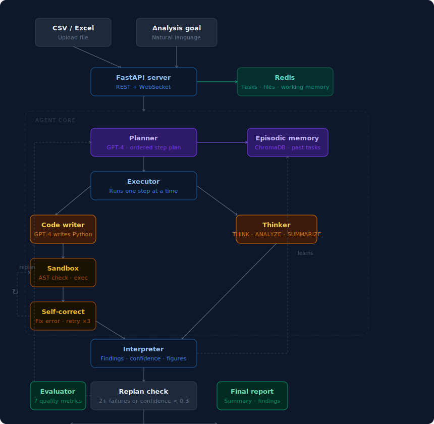

# ⚡ QuillAI — Autonomous Data Analysis Agent

An autonomous AI agent that takes a natural language goal and a dataset, plans a multi-step analysis, writes and executes Python code, self-corrects errors, and produces a verified report — with a full scientific evaluation framework.

> **Tested across 4 datasets · 32 tasks · 81% avg confidence · 24 self-corrections tracked**
> [View full evaluation report →](outputs/eval_report.html)

---

## Architecture



---

## Key Technical Features

### Plan-first architecture
Before executing anything, Lamma creates a structured plan: ordered steps with explicit types (`THINK` / `CODE` / `ANALYZE` / `VALIDATE` / `SUMMARIZE`), rationale for each step, and a dependency graph. This separates thinking from doing.

### Self-correction loop
```
Write code → Execute in sandbox → [Error?] → Fix code → Retry (×3)
                    ↓ [Success]
              Interpret output → Update state
```
Every code failure feeds the full error message and data schema back to Llama3.1 to generate a fix. Self-corrections are tracked as an evaluation metric. The most common fix: `KeyError` on column names where the LLM writes `df['MonthlyCharges']` but the column is `df['monthly_charges']`.

### Sandboxed code execution
AST-level static analysis before any execution — blocks dangerous imports (`os`, `subprocess`, `socket`, `pickle`) before a single line runs. SIGALRM timeout kills runaway code. Captures stdout, matplotlib figures (base64 PNG), and DataFrames automatically.

### Two-tier memory
- **Working memory (Redis):** per-task scratchpad — findings, step outputs, retry counters. TTL 2 hours, auto-cleaned.
- **Episodic memory (ChromaDB):** persists across tasks — successful code patterns, error resolutions, past task summaries. Queried at task start to inject relevant past experience.

### Adaptive replanning
After each step the agent checks: ≥2 consecutive failures, or confidence < 0.3? If either is true, the Planner is called again with the current state and a revised plan is created for the remaining steps.

### WebSocket streaming
Every agent event is broadcast live. Clients see the plan appear, each step start and complete, and self-corrections in real time — zero polling required.

---

## Evaluation Results

Evaluated across **4 datasets · 32 tasks** on March 20, 2026.

| Metric | Result |
|---|---|
| Total tasks | 32 |
| Fully complete | 11 (34%) |
| Partial (replanned) | 18 (56%) |
| Failed | 3 (9%) |
| Avg confidence | 81% |
| Avg latency | 76s |
| Self-corrections applied | 24 |
| Figures generated | 8 |
| Total key findings | 212 |

**By dataset:**

| Dataset | Tasks | Avg confidence | Notes |
|---|---|---|---|
| Breast cancer UCI | 8 | 85% | Best overall accuracy |
| Telco churn | 9 | 80% | Most self-corrections |
| Tips (seaborn) | 8 | 82% | Fastest avg latency |
| Titanic | 7 | 78% | Most replanning triggered |

> [Full task-by-task breakdown with figures →](eval_report.html)

---

## Tech Stack

| Layer | Technology                      |
|---|---------------------------------|
| LLM | Groq llama-3.1-8b-instant / llama-3.3-70b-versatile            |
| Agent framework | LangChain                       |
| Vector memory | ChromaDB                        |
| Working memory | Redis 7                         |
| Code execution | RestrictedPython + AST sandbox  |
| API | FastAPI + WebSocket             |
| Evaluation | Custom LLM-as-judge (7 metrics) |
| Goal suggester | Groq free API (llama-3.1-70b)   |

---

## Project Structure

```
datawright/
├── configs/
│   └── settings.py              # Pydantic config from .env
├── src/
│   ├── agent/
│   │   ├── models.py            # AgentState, Plan, Step, StepResult
│   │   ├── planner.py           # Creates + revises execution plans
│   │   ├── executor.py          # Runs steps + self-correction loop
│   │   └── agent.py             # Main orchestrator + event loop
│   ├── tools/
│   │   └── code_executor.py     # AST sandbox + exec + figure capture
│   ├── memory/
│   │   └── memory_manager.py    # WorkingMemory (Redis) + EpisodicMemory (ChromaDB)
│   ├── db/
│   │   └── redis_client.py      # Redis helpers with in-memory fallback
│   ├── evaluation/
│   │   └── agent_evaluator.py   # 7-metric scientific evaluation
│   └── server/
│       └── main.py              # FastAPI + WebSocket endpoints
├── goal_suggester.py            # Groq-powered analysis goal generator
├── demo.py                      # End-to-end demo with synthetic data
├── run_analysis.py              # CLI: upload + analyze + print results
├── eval_report.html             # Full evaluation results
├── Dockerfile
├── docker-compose.yml
├── Makefile
└── requirements.txt
```

---

## Quick Start

```bash
# 1. Clone and install
git clone https://github.com/yourusername/datawright
cd datawright
python3.11 -m venv venv && source venv/bin/activate
pip install -r requirements.txt

# 2. Configure
cp .env.example .env
# Add OPENAI_API_KEY to .env

# 3. Start Redis (Docker)
docker run -d -p 6379:6379 redis:alpine

# 4. Run demo (generates synthetic data automatically)
python demo.py

# 5. Start API server
uvicorn src.server.main:app --reload --reload-dir src --log-level info
```

---

## Services:
- API + docs: `http://localhost:8000/docs`
- Redis UI: `http://localhost:8001`

--

## API Usage

```bash
# Upload a file
curl -X POST http://localhost:8000/upload -F "file=@customers.csv"
# → {"file_key": "abc12345"}

# Start analysis (async)
curl -X POST http://localhost:8000/analyze \
  -H "Content-Type: application/json" \
  -d '{"goal": "Find the top 3 churn drivers and build a model", "file_key": "abc12345"}'
# → {"task_id": "9e2d7f1a", "websocket_url": "/ws/9e2d7f1a"}

# Poll for results
curl http://localhost:8000/task/9e2d7f1a

# Or run sync (waits for completion)
curl -X POST http://localhost:8000/analyze/sync \
  -H "Content-Type: application/json" \
  -d '{"goal": "Find the top 3 churn drivers", "file_key": "abc12345"}'
```

---

## Example Datasets

| Dataset | Rows | Example goal |
|---|---|---|
| Telco churn | 7,043 | "Find top 3 churn drivers and build a predictive model" |
| Breast cancer UCI | 569 | "Which features best separate malignant from benign tumors?" |
| Superstore sales | 9,994 | "Which product categories lose money and why?" |
| Titanic | 891 | "What factors best predict survival? Build a classifier." |

```bash
# Download Telco churn (no Kaggle login needed)
curl -L "https://raw.githubusercontent.com/IBM/telco-customer-churn-on-icp4d/master/data/Telco-Customer-Churn.csv" \
     -o data/telco_churn.csv

# Run analysis
python run_analysis.py data/telco_churn.csv "Find the top 3 factors driving churn"
```

---

## Evaluation Framework

7 metrics measured per task:

| Metric | Type | Measures |
|---|---|---|
| Task completion rate | Deterministic | Did it reach COMPLETED status? |
| Step success rate | Deterministic | % of steps that succeeded |
| Self-correction success | Deterministic | Did corrections actually fix the error? |
| Answer quality | LLM judge (0–1) | Is the answer comprehensive and specific? |
| Plan quality | LLM judge (0–1) | Was the plan appropriate for the goal? |
| Plan efficiency | Deterministic | Useful steps / total steps |
| Answer grounding | LLM judge (0–1) | Are claims based on actual data? |

Run evaluation on your own test set:

```python
from src.evaluation.agent_evaluator import AgentEvaluator, EvalSample

evaluator = AgentEvaluator(run_name="my_run")
metrics = evaluator.evaluate(samples, use_ragas=False)
```

---

## Requirements

- Python 3.11
- OpenAI API key (`gpt-4o-mini` recommended for cost — ~$0.05 per task)
- Redis (local or Docker)
- Groq API key for goal suggester (free at console.groq.com)
